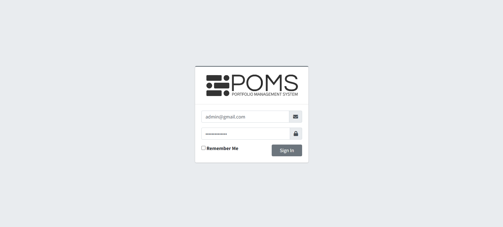
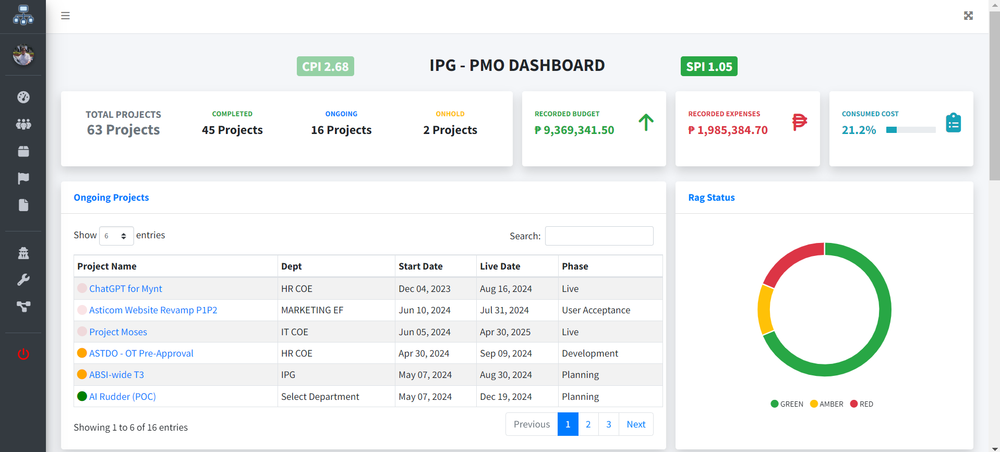
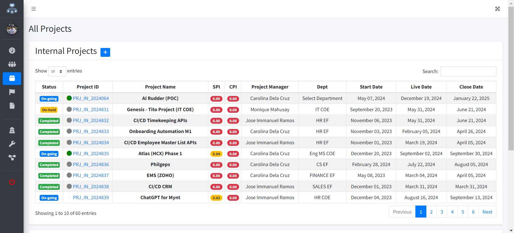
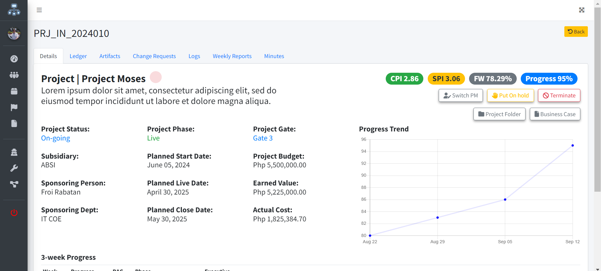
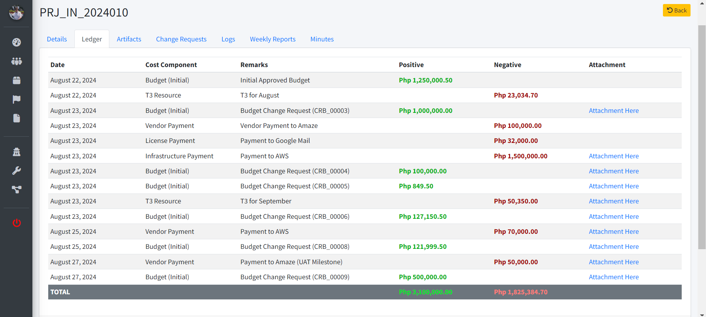

# Portfoltio Management System (POMS)
##### Developed by: Rod Eliziah Molina
##### Email: eliziahmolina@gmail.com
##### Viber: +63 906 024 6403
##### Github: https://github.com/eliziah

## Project Description
The intent for this project is to be used by corporations, organizations, or freelancers - to manage their projects on a portfolio level

## Features

- Authentication
- Dashboard
- Projects
    - Add Projects
    - Update Project Progress
- Project Progress
    - Update RAG Status
    - Update Progress %
    - Update Phase
    - Update Gate
- Weekly Reports
- Minutes of the Meeting (MOM)

## Screenshots

